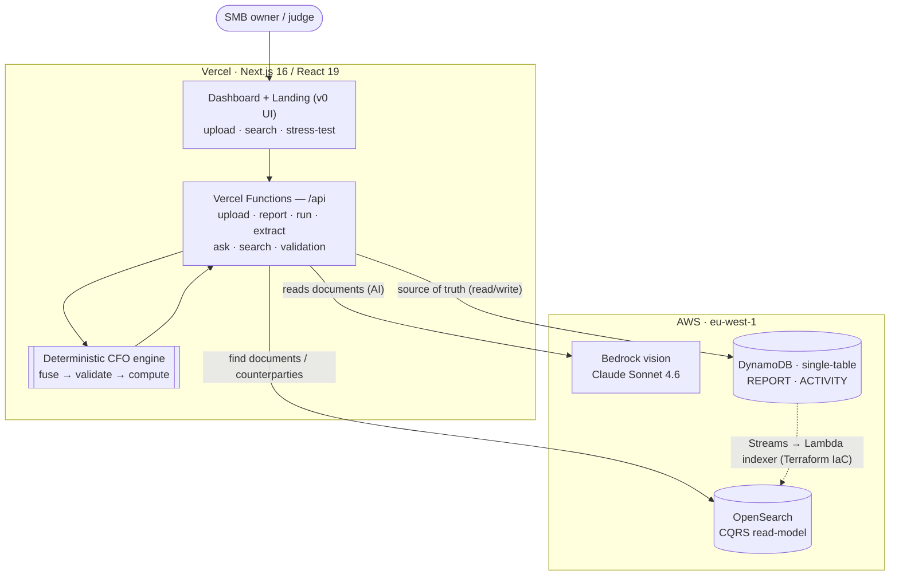
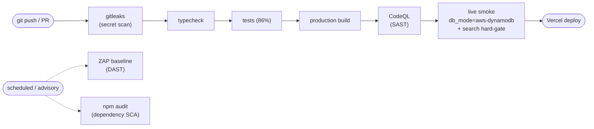

# Archon H0: Vercel + AWS

Live app: https://h0-archon.vercel.app
Demo video: https://h0-archon.vercel.app/archon-h0-demo.mp4
Evidence CI: https://github.com/upgradedev/h0-archon/actions/workflows/h0-archon-ci.yml

Archon H0 is the fast Vercel + AWS challenge build of Archon. Archon is a
**document-collection and auto-correlation engine**: it gathers every document a
business receives — purchases, sales, payments, receipts, payroll — links the
related ones into single financial events, and tells you whether your books are
**complete and reconciled**. On top of that it presents an SMB finance command
center: P&L, account-statement movement, sales performance versus goals,
purchase concentration, and payroll controls.

The demo runs on **ARCHON DEMO IKE** (period **January 2026**). The headline
correlation is the payroll wedge: the bank confirmation shows only the
**€3,994.74** net salary that left the account, but once it is correlated with
the payroll register and payslips the **true employer cost is €6,930** — a
**€2,935.26** monthly understatement, driven by **€1,430** of employer
social-security (IKA) that is **35.8% on top of the net** and never appears on
the bank statement. This is not a "gotcha": it is the ordinary employer-IKA wedge
that a single-document view never records.

## What's live

- **Drop a document on the dashboard** — the upload lives on the **eight-agent run
  ledger** tile: drop a PDF and the agents light up in sequence (Extractor reads it
  live via **AWS Bedrock** vision, Claude Sonnet 4.6 → Classifier → Event Linker →
  Validator → PnL → CashFlow → Employee → Narrator), then the **affected tiles flash
  and refresh** with the recomputed numbers — a per-session "what-if" that never
  overwrites the shared demo. (`/extract` remains the curated-sample read demo with
  accuracy scored against ground truth.)
- **Full monthly close** — that **eight-agent** pipeline produces P&L, cash flow,
  sales-vs-goal, supplier concentration, and payroll controls.
- **Search** — find any uploaded **document, vendor or person** in milliseconds via
  an **AWS OpenSearch** CQRS read-model fed from DynamoDB Streams (documents-first;
  the aggregated close and Q&A logs are kept out of search results).
- **Verification-gating** — four cross-document rules (R1–R4) must pass before the
  fused event is trusted; the dashboard surfaces each rule's status.
- **Multi-period trends**, persisted **run history**, source-backed **citations**,
  and an **Ask Archon** Q&A panel.
- **Infrastructure as Code** — the entire AWS tier (DynamoDB, OpenSearch, the
  Streams→Lambda indexer, IAM) is defined in Terraform under `terraform/`.

> *"We ran Archon on our own books — it pulled together the bank, payroll and
> invoices and told us in seconds that everything reconciled. That used to take
> our accountant the better part of a day."* — Founder, ARCHON DEMO IKE

**Auth posture — demonstrated, not gatekeeping.** GitHub OAuth (NextAuth v5) is a
real, working capability: you can sign in, a session is issued and verified, and
your identity shows in the header. But sign-in is *offered, never required* — the
demo routes are intentionally left open so a reviewer can explore the entire
financial-intelligence experience without a login wall. Enforcement is one edit
away (`ENFORCE_PAGES` / `ENFORCE_APIS` in `middleware.ts`); the redirect/401 path
is present and exercised — we keep it empty on the hosted demo on purpose.

## Architecture



> The earlier static figure (`docs/figures/h0-architecture.svg`) is superseded by
> the inline diagram above.

## CI/CD



## Explore

| What | Where |
|---|---|
| Live app | https://h0-archon.vercel.app |
| Demo video | https://h0-archon.vercel.app/archon-h0-demo.mp4 |
| Live API | `/api/report` · `/api/upload` · `/api/search` · `/api/evidence` · `/api/history` |
| Infrastructure as Code | [`terraform/`](terraform/) |
| Security & OWASP posture | [`docs/SECURITY.md`](docs/SECURITY.md) |
| Extraction-accuracy eval | [`eval/`](eval/) |
| Content (blog, devlog, LinkedIn) | [`docs/BLOG.md`](docs/BLOG.md) · [`docs/CONTENT_DEVLOG.md`](docs/CONTENT_DEVLOG.md) · [`docs/CONTENT_LINKEDIN.md`](docs/CONTENT_LINKEDIN.md) |
| Docs index (front door to `docs/`) | [`docs/README.md`](docs/README.md) |

## Stack

- Next.js app for Vercel (Vercel Functions for every `/api` route)
- **AWS DynamoDB** single-table store (`REPORT` · `ACTIVITY`) — source of truth
- **AWS OpenSearch** CQRS read-model, indexed from DynamoDB Streams via a Lambda
- **AWS Bedrock** (Claude Sonnet 4.6) vision extraction
- Deterministic CFO rules engine running in Vercel Functions
- Embedded demo mode when no AWS database is configured

## Run

```bash
npm install
npm run build
npm run pipeline
npm run dev
```

Open `http://localhost:3000`.

## AWS Database

Set the DynamoDB table and AWS credentials, then the app persists every
finance-close report and audit-activity record to AWS DynamoDB:

```bash
DYNAMODB_TABLE=h0-archon-reports
AWS_REGION=eu-west-1
AWS_ACCESS_KEY_ID=...
AWS_SECRET_ACCESS_KEY=...
```

Seed one report into the active store:

```bash
npm run db:seed
```

With no AWS env vars set, the app runs in an in-process demo store so the full
pipeline and dashboard work locally with no database.

## Pages

- `/` — marketing landing (the value prop, completeness/correlation hook, the
  module grid including search, and the Vercel + AWS stack).
- `/dashboard` — the full finance-close command center (the product) — **including
  document upload on the agent-ledger tile** (drop → agents animate → tiles flash).
- `/extract` — the curated-sample read demo: pick a sample PDF, watch AWS Bedrock
  vision read it, and see field accuracy scored against ground truth. Degrades
  gracefully to a cached example when `BEDROCK_*` / AWS creds are not configured.

A shared top nav links Home / Dashboard / Live Extract on every page.

## Judge Path

1. Open `https://h0-archon.vercel.app` (landing), then click **Open the
   dashboard** — or go straight to `https://h0-archon.vercel.app/dashboard`.
2. Press **Run Finance Close**.
3. Confirm the dashboard shows:
   - document intake with bank/sales/purchases/payroll coverage
   - eight-agent run ledger
   - P&L revenue: EUR 47,200
   - EBITDA: EUR 30,698 (65% margin)
   - sales goal attainment: 101.5%
   - closing cash: EUR 79,498
   - supplier concentration watch: AI-model spend at 28% of COGS
   - bank confirmation: EUR 3,994.74
   - true employer cost: EUR 6,930
   - correlation wedge (only visible once correlated): EUR 2,935.26
   - employer social-security (Greece's IKA): 35.8% of net
   - source-backed citations and Ask Archon answer panel
4. **On the dashboard, drop a document on the 8-agent ledger tile** — watch the
   agents fire in sequence (Extractor reads it live via Bedrock) and the affected
   tiles flash + refresh with the recomputed numbers (per-session). `docs/demo/`
   has fictional sample documents to drop.
5. Use **Search** to find any document, vendor or person across the corpus.
6. Open `https://h0-archon.vercel.app/api/report` to verify the JSON API and
   persistence mode. The live deployment should report `db_mode:
   "aws-dynamodb"`.
7. Open `/api/upload`, `/api/search`, `/api/ask`, `/api/history`, and
   `/api/evidence` for intake, search, conversational answers, persisted run and
   activity history, and sponsor-stack evidence.

## Security

Full posture, OWASP mapping, and threat model: **`docs/SECURITY.md`**.

- **Scanning in CI** — gitleaks (secrets, blocking), `npm audit` (SCA, advisory),
  **CodeQL** SAST (`.github/workflows/codeql.yml`), and an **OWASP ZAP** passive
  baseline DAST against the live app (`.github/workflows/zap-baseline.yml`,
  advisory / scheduled).
- **OWASP Top 10 (2021)** and **OWASP LLM Top 10** reviewed item-by-item in
  `docs/SECURITY.md` — injection-safe (parameterized DynamoDB + OpenSearch),
  prompt-injection guardrail on the Bedrock extraction, deterministic engine
  computes the numbers (the LLM only reads), ephemeral uploads.
- **Security headers** on every route via `next.config.mjs`
  (`X-Content-Type-Options`, `X-Frame-Options: DENY`, `Referrer-Policy`,
  `Permissions-Policy`, HSTS, and a report-only CSP).
- **Open demo posture is intentional** (auth offered, not enforced) and documented;
  enforcement scaffolding is one edit away in `middleware.ts`.

## Evidence

- Public repo: https://github.com/upgradedev/h0-archon
- Public app: https://h0-archon.vercel.app
- Demo video: https://h0-archon.vercel.app/archon-h0-demo.mp4
- Live API: https://h0-archon.vercel.app/api/report
- Search API: https://h0-archon.vercel.app/api/search
- Upload API: https://h0-archon.vercel.app/api/upload
- Ask API: https://h0-archon.vercel.app/api/ask
- Run history API: https://h0-archon.vercel.app/api/history
- Judge evidence API: https://h0-archon.vercel.app/api/evidence
- Submission package: `SUBMISSION.md`
- Docs index: `docs/README.md`
- AWS DynamoDB proof: `docs/DYNAMODB_PROOF.md`
- Data-tier design + scale path (DynamoDB → CQRS + OpenSearch): `docs/ARCHITECTURE_SCALE.md`
- Extraction-accuracy eval: `eval/`
- v0 provenance checklist: `docs/V0_USAGE.md`
- CI gate: `npm ci`, TypeScript, unit tests, production build, pipeline JSON
  evidence artifact, and live Vercel + AWS DynamoDB smoke covering report,
  intake activity, ask activity, search, and history.
- Check the Actions link above for the latest final-run status.
</content>
</invoke>
