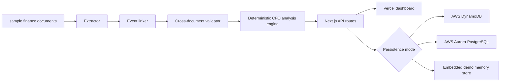

# H0 Archon Architecture and Judge Evidence

## Purpose

H0 Archon proves a compact SMB finance intelligence loop on Vercel + AWS:
fuse account-statement movement, sales goals, purchase categories, and payroll
controls into one auditable monthly close. The payroll control remains the
headline evidence-backed anomaly: the bank-visible salary transfer is EUR
5,956.67, while the true employer cost is EUR 9,110.62, exposing a EUR 3,153.95
monthly understatement.

## Runtime Architecture



## Persistence Modes

- `DYNAMODB_TABLE` or `AWS_DYNAMODB_TABLE`: serverless AWS DynamoDB path.
- `DATABASE_URL`: Aurora PostgreSQL fallback using `db/schema.sql`.
- No database env vars: embedded demo mode, used by local tests and CI so judges
  can reproduce results without cloud credentials.

## Evidence Checks

Run from this directory:

```bash
npm ci
npm run typecheck
npm test
npm run build
npm run pipeline
```

Expected finance-close invariants:

- `analysis_engine`: `deterministic-finance-engine`
- P&L revenue: `96800`
- sales goal attainment: `96.8%`
- `event.bank_net_total`: `5956.67`
- `event.employer_cost_total`: `9110.62`
- `event.hidden_total`: `3153.95`
- `event.cost_gap_pct`: `27.88`
- `validations`: R1 through R4 pass for the canonical sample

## CI/CD Layer

`.github/workflows/h0-archon-ci.yml` performs a non-deploying evidence gate:
`npm ci`, TypeScript checking, unit tests, production build, and pipeline JSON
artifact upload. The workflow blanks database environment variables
so it always exercises the deterministic embedded-demo path.

## Judge Path

1. Start the app with `npm run dev`.
2. Open `http://localhost:3000`.
3. Click **Run Finance Close**.
4. Verify the dashboard and `/api/report` show P&L, cash, sales performance,
   purchase concentration, payroll control gap, and the active persistence mode.
