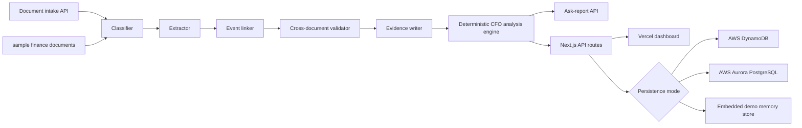

# H0 Archon Architecture and Judge Evidence

## Purpose

H0 Archon proves a compact SMB finance intelligence loop on Vercel + AWS:
fuse account-statement movement, sales goals, purchase categories, and payroll
controls into one auditable monthly close. The demo entity is **ARCHON DEMO
IKE** (period January 2026). The payroll control remains the headline
evidence-backed anomaly: the bank-visible salary transfer is EUR 3,994.74, while
the true employer cost is EUR 6,930.00, exposing a EUR 2,935.26 monthly
understatement (EUR 1,430 of employer social-security, 35.8% on top of the net).

## Runtime Architecture



## Persistence Modes

- `DYNAMODB_TABLE` or `AWS_DYNAMODB_TABLE`: serverless AWS DynamoDB path.
- `DATABASE_URL`: Aurora PostgreSQL fallback using `db/schema.sql`.
- No database env vars: embedded demo mode, used by local tests and CI so judges
  can reproduce results without cloud credentials.
- DynamoDB uses a single-table shape:
  - `pk=REPORT`, `sk=<generated_at>` for finance-close reports.
  - `pk=ACTIVITY`, `sk=<created_at>#<activity_id>` for document-intake and
    ask-report activity.

See also:

- `docs/DYNAMODB_PROOF.md`
- `docs/ARCHITECTURE.mmd`
- `docs/figures/h0-architecture.svg`

## Evidence Checks

Run from this directory:

```bash
npm ci
npm run typecheck
npm test
npm run build
npm run pipeline
```

Expected finance-close invariants:

- `analysis_engine`: `deterministic-finance-engine`
- `/api/history`: returns persisted `reports` and `activity`
- `/api/evidence`: includes `records=REPORT+ACTIVITY`
- P&L revenue: `47200`
- sales goal attainment: `101.5%`
- source citations: `4`
- `event.bank_net_total`: `3994.74`
- `event.employer_cost_total`: `6930.00`
- `event.hidden_total`: `2935.26`
- `event.cost_gap_pct`: `35.8`
- `validations`: R1 through R4 pass for the canonical sample

## CI/CD Layer

`.github/workflows/h0-archon-ci.yml` performs a non-deploying evidence gate:
`npm ci`, TypeScript checking, unit tests, production build, and pipeline JSON
artifact upload. The workflow blanks database environment variables
so it always exercises the deterministic embedded-demo path.

## Judge Path

1. Start the app with `npm run dev`.
2. Open `http://localhost:3000`.
3. Click **Run Finance Close**.
4. Verify the dashboard and `/api/report` show P&L, cash, sales performance,
   purchase concentration, payroll control gap, citations, Q&A, and the active
   persistence mode.
